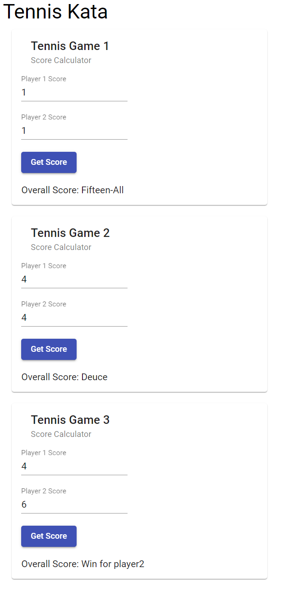

## How to Run Tests

1. Install [Angular](https://angular.io/guide/setup-local)
2. From this `angular` directory, on the command line run `npm i`
3. To run tests via [Karma](https://karma-runner.github.io) and Jasmine, on the command line run `ng t`
4. For even faster test feedback, add the [Wallaby](https://wallabyjs.com/) extension to your IDE

## How to Run the Web App

1. From this `angular` directory, on the command line run `ng serve -o --watch`

## Current Implementation
  
- Components for tennis games 1, 2, and 3 and the corresponding tests are in `src/app`
- Html/gui functionality to get a score from either tennis game 1, 2, or 3
- Updated unit tests to interact with DOM instead of calling class methods
- Styled each game with material design and scss to make GUI look better
- Wrote unit tests against important look and feel aspects of the web page. Now the kata allows you to refactor the ts, angular, html, and css product code all under a fast suite of unit tests that cover it all.
- Added unique html and css code smells to each tennis game for more refactoring opportunities
- Added unit tests for app component
- Practiced completing the kata at least once for refactoring css and html
- Post kata on social media for feedback
- All [ZOMBIE cases](https://trello.com/c/5EyJyuzJ/242-test-driven-development-guided-by-zombies) test driven

## Future Plans

- Mob with UI/UX designer to make more look and feel improvements to the kata and also to introduce more css/html code smells
- Experiment with TCR tool and add instructions for TCR setup in this readme

  
